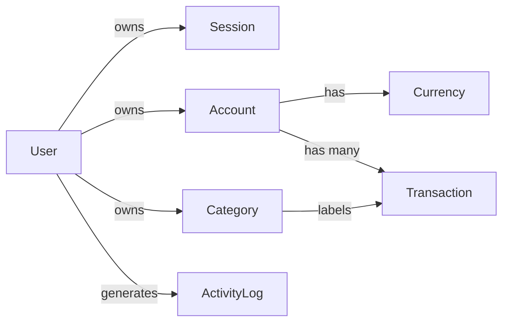
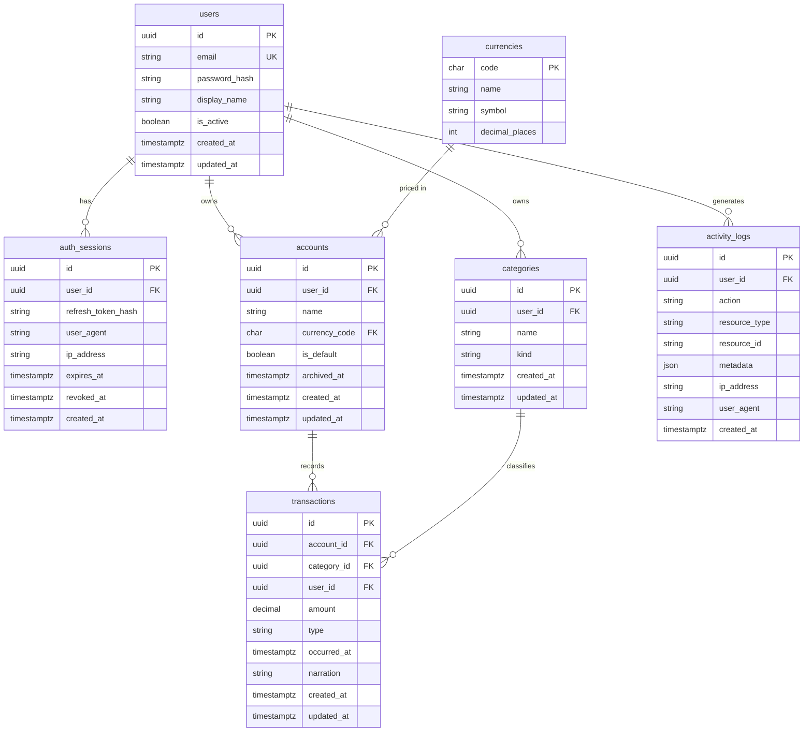
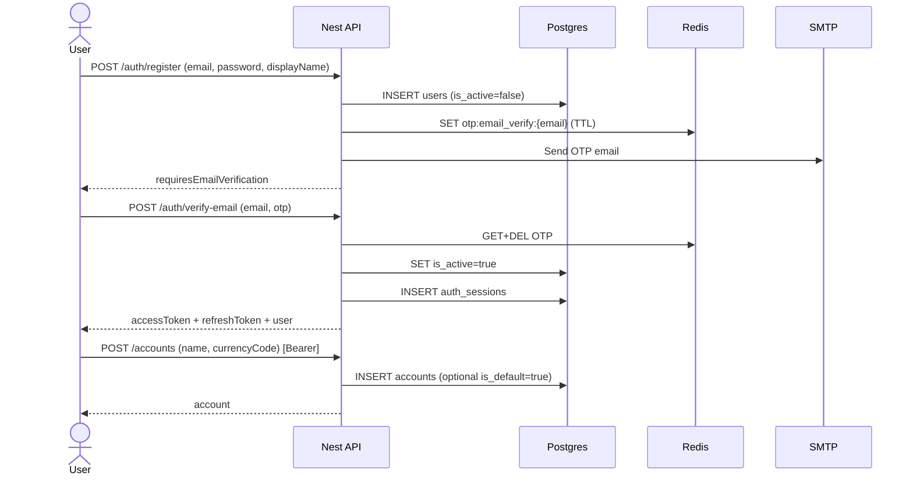
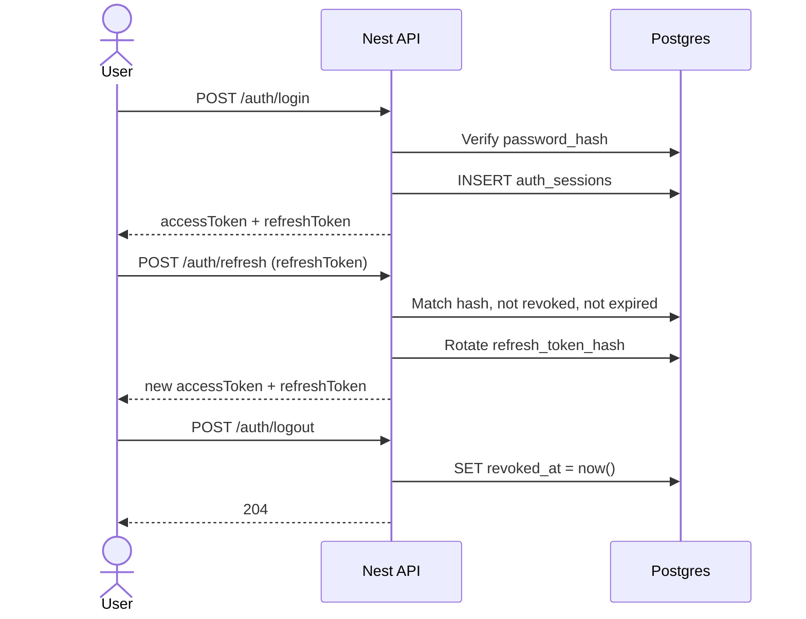
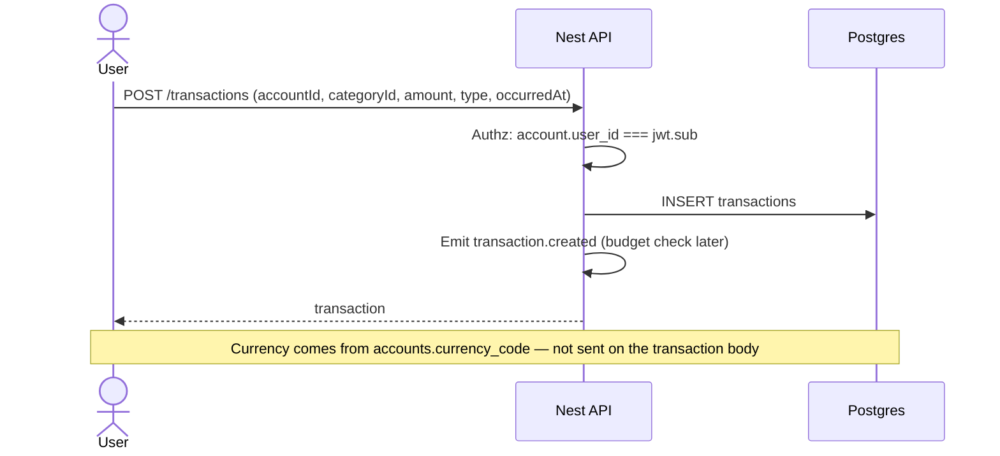
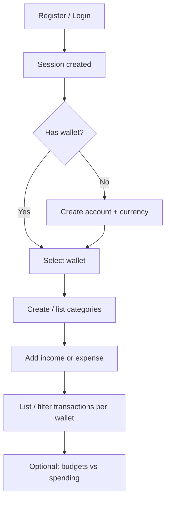

# Database schema & user flows

Design for a basic multi-wallet expense tracker: **auth → sessions → accounts (wallets) → transactions**.

Categories (assignment requirement) are included so every transaction has a category. Budgets can plug in later without changing the core graph.

---

## Goals

1. A user can register / log in and hold **refresh sessions**.
2. Signup requires **email OTP verification** before the account is active (`users.is_active`).
3. Password reset and change-password use email OTPs stored in **Redis** (TTL).
4. A user can create one or more **accounts/wallets**, each with its own **currency**.
5. Transactions belong to a **wallet** (and thus inherit that wallet’s currency).
6. Postgres is the source of truth for users/sessions; Redis holds short-lived OTPs (and later cache/queues).

---

## Domain overview



### Activity logs — yes, it makes sense

An `activity_logs` table is a good fit for this API:

- Audits **who did what** (auth, wallet changes, transaction CRUD)
- Matches the assignment’s “log activity” listener idea without coupling logs to Kafka
- Supports support/debug (“when was this session revoked?”)
- Keep writes **append-only** and preferably async (EventEmitter → log writer) so request latency stays low

Do **not** put huge request/response bodies in logs. Store action + resource ids + small JSON metadata.

**HTTP logging pattern:** decorate handlers with `@LogActivity({ action: ActivityAction.… })`. A global `ActivityLogInterceptor` writes the row after a successful response. `user_id` is optional — resolved from the response path (`userIdFrom`) or from `req.user` after JWT auth. Domain/job side-effects can still call `RecordActivityLogUseCase` directly.

---

## Entity-relationship diagram



---

## Table definitions

### `users`

| Column | Type | Notes |
|--------|------|--------|
| `id` | `uuid` PK | |
| `email` | `citext` / `varchar` UK | Unique, normalized lowercase |
| `password_hash` | `varchar` | Argon2id or bcrypt — never store plaintext |
| `display_name` | `varchar` | |
| `is_active` | `boolean` | `false` until email OTP verified; also used to soft-disable |
| `created_at` / `updated_at` | `timestamptz` | |

### `auth_sessions`

Represents a **refresh-token session** (device/browser login). Access tokens stay short-lived JWTs (not stored).

| Column | Type | Notes |
|--------|------|--------|
| `id` | `uuid` PK | Also usable as `jti` / session id in JWT claims |
| `user_id` | `uuid` FK → `users` | Cascade delete optional; prefer restrict + revoke |
| `refresh_token_hash` | `varchar` | Hash of refresh token only |
| `user_agent` | `varchar` nullable | |
| `ip_address` | `inet` / `varchar` nullable | |
| `expires_at` | `timestamptz` | |
| `revoked_at` | `timestamptz` nullable | Logout / revoke all |
| `created_at` | `timestamptz` | |

Indexes: `(user_id)`, `(expires_at)`, unique on `refresh_token_hash`.

### `activity_logs`

Append-only audit trail of API-domain activity.

| Column | Type | Notes |
|--------|------|--------|
| `id` | `uuid` PK | |
| `user_id` | `uuid` FK → `users` nullable | Optional — null when no authenticated user yet |
| `action` | `varchar` | Values from `ActivityAction` enum (e.g. `auth.login`) |
| `resource_type` | `varchar` nullable | e.g. `user`, `auth_session`, `transaction` |
| `resource_id` | `varchar` nullable | Target id as string |
| `metadata` | `jsonb` nullable | Small structured context only |
| `ip_address` | `varchar` nullable | |
| `user_agent` | `varchar` nullable | |
| `created_at` | `timestamptz` | No `updated_at` — immutable |

Indexes: `(user_id, created_at DESC)`, `(action, created_at DESC)`, `(resource_type, resource_id)`.

### `currencies`

Seeded reference data (ISO 4217 subset).

| Column | Type | Notes |
|--------|------|--------|
| `code` | `char(3)` PK | e.g. `USD`, `EUR`, `XAF` |
| `name` | `varchar` | |
| `symbol` | `varchar` | e.g. `$`, `€` |
| `decimal_places` | `smallint` | Usually `2`; some currencies `0` |

Wallets **do not** convert FX in v1 — each account is single-currency.

### `accounts` (wallets)

| Column | Type | Notes |
|--------|------|--------|
| `id` | `uuid` PK | |
| `user_id` | `uuid` FK → `users` | |
| `name` | `varchar` | e.g. “Cash”, “Revolut EUR” |
| `currency_code` | `char(3)` FK → `currencies` | Fixed for the life of the account (v1) |
| `is_default` | `boolean` | At most one default per user (partial unique index) |
| `archived_at` | `timestamptz` nullable | Soft archive; hide from pickers |
| `created_at` / `updated_at` | `timestamptz` | |

**Balance:** do **not** store a mutable `balance` column in v1. Derive:

```text
balance = sum(income amounts) - sum(expense amounts)
```

for that `account_id`. Add a cached balance later if needed (updated via domain events).

### `categories`

User-scoped (assignment: create + list).

| Column | Type | Notes |
|--------|------|--------|
| `id` | `uuid` PK | |
| `user_id` | `uuid` FK → `users` | |
| `name` | `varchar` | Unique per user recommended |
| `kind` | `varchar` / enum | `income` \| `expense` \| `both` |
| `created_at` / `updated_at` | `timestamptz` | |

### `transactions`

| Column | Type | Notes |
|--------|------|--------|
| `id` | `uuid` PK | |
| `account_id` | `uuid` FK → `accounts` | Wallet; implies currency |
| `category_id` | `uuid` FK → `categories` | Required |
| `user_id` | `uuid` FK → `users` | Denormalized for authz queries (must match account owner) |
| `amount` | `numeric(19, 4)` | Always **> 0**; sign via `type` |
| `type` | `varchar` / enum | `income` \| `expense` |
| `occurred_at` | `timestamptz` | Business date/time of the entry |
| `narration` | `text` nullable | |
| `created_at` / `updated_at` | `timestamptz` | |

Constraints:

- `amount > 0`
- `type in ('income', 'expense')`
- Category `kind` must be compatible with transaction `type` (enforce in application layer)
- Account must belong to `user_id`

Indexes: `(account_id, occurred_at DESC)`, `(user_id, occurred_at DESC)`, `(category_id)`.

---

## Auth model (access + refresh)

```text
Access token  = short-lived JWT (e.g. 15m) — claims: sub=userId, sid=sessionId
Refresh token = opaque random string — only hash stored in auth_sessions
```

| Action | Effect |
|--------|--------|
| Login / register | Create `auth_sessions` row + return access + refresh |
| API call | Bearer access JWT; guard loads user (+ optional session check) |
| Refresh | Validate refresh hash, rotate token, extend or replace session |
| Logout | Set `revoked_at` on session |
| Logout all | Revoke all sessions for `user_id` |

---

## User flows

### 1. Register, verify email OTP, first wallet

**Chosen flow:** register creates the user as **inactive** (`is_active=false`), emails an OTP (Redis TTL), and does **not** open a session. Login is blocked until `POST /auth/verify-email` succeeds (activates the user and opens a session).



### 1b. Forgot password & change password (OTP)

| Endpoint | Behavior |
|----------|----------|
| `POST /auth/forgot-password` | If active user exists, store reset OTP in Redis and email it (generic response either way) |
| `POST /auth/reset-password` | Verify OTP → update password hash → revoke all sessions |
| `POST /auth/change-password/request` | Verify current password → email change OTP |
| `POST /auth/change-password/confirm` | Verify OTP → update password → revoke all sessions |

**OTP mode:** `EMAIL_OTP_MODE=fixed` always uses `123456` (dev); `live` generates a secure random 6-digit code. TTL: `EMAIL_OTP_TTL_SECONDS`.

### 2. Login & session refresh



### 3. Transaction on a wallet



### 4. High-level product journey



---

## Suggested API surface (auth + wallets + transactions)

| Area | Methods |
|------|---------|
| Auth | `POST /auth/register`, `POST /auth/verify-email`, `POST /auth/login`, `POST /auth/refresh`, `POST /auth/logout`, `POST /auth/forgot-password`, `POST /auth/reset-password`, `POST /auth/change-password/request`, `POST /auth/change-password/confirm` |
| Accounts | `POST /accounts`, `GET /accounts`, `GET /accounts/:id`, `PATCH /accounts/:id` |
| Currencies | `GET /currencies` (seeded) |
| Categories | `POST /categories`, `GET /categories` |
| Transactions | Full CRUD scoped by account / user |

All account/category/transaction routes require a valid access token. Frontend `middleware.ts` can gate pages; API remains the source of truth for authz.

---

## Implementation notes (Nest / hexagonal)

Align with `src/modules/<feature>/` ports & adapters:

| Module | Owns |
|--------|------|
| `auth` | users lookup for login, sessions port, JWT |
| `users` | profile (thin) |
| `accounts` | wallets + currency binding |
| `categories` | user categories |
| `transactions` | entries + events |

Recommended first build order:

1. Migrations + seed currencies  
2. Auth (register/login/refresh/logout)  
3. Accounts  
4. Categories  
5. Transactions  
6. Budgets + listeners  

---

## Out of scope for this schema (v1)

- FX conversion / multi-currency single wallet  
- Transfers between wallets (can be two transactions later)  
- OAuth / social login  
- Storing access tokens server-side  
- Kafka  

---

## Open choices (confirm when implementing)

1. **Default wallet on register** — auto-create “Main” in a default currency vs force explicit create.  
2. **Currency change** — forbidden after create (recommended) vs allow only if zero transactions.  
3. **Refresh rotation** — always rotate on refresh (recommended) vs reuse until expiry.
