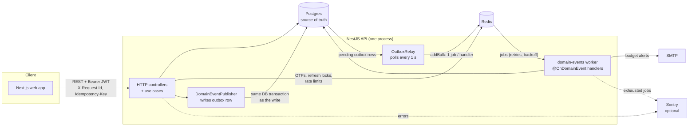
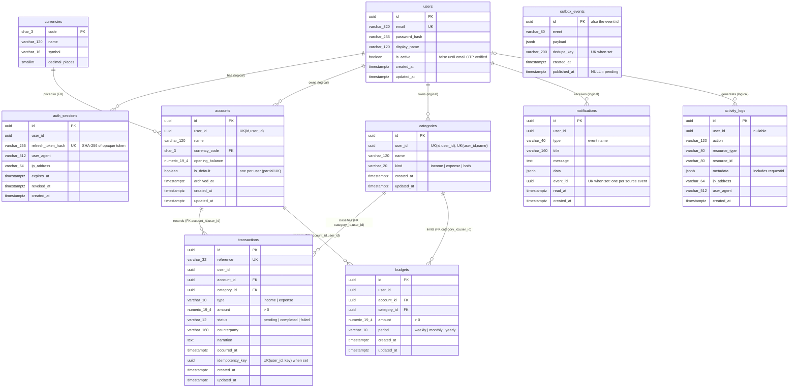
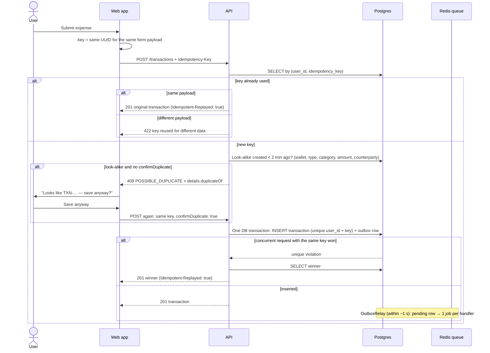
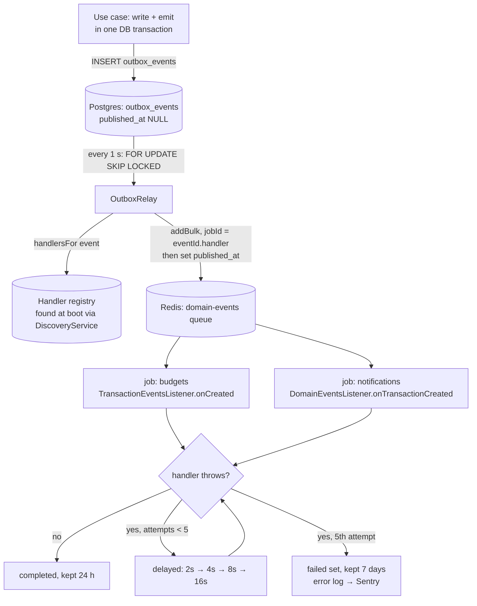
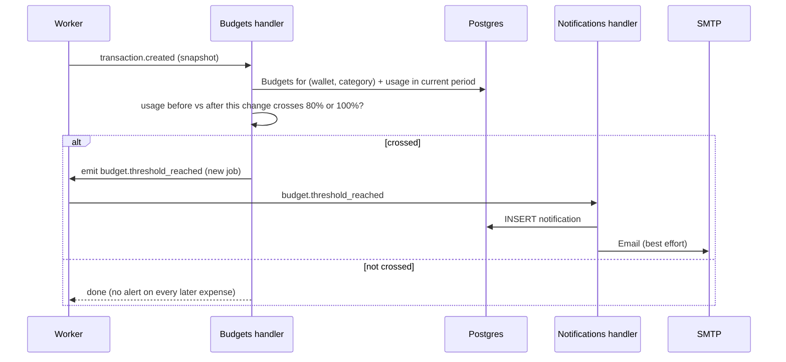
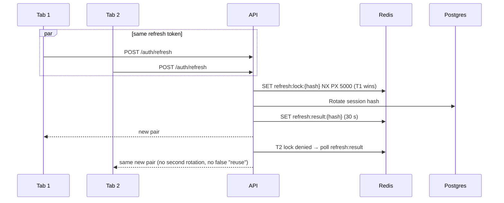
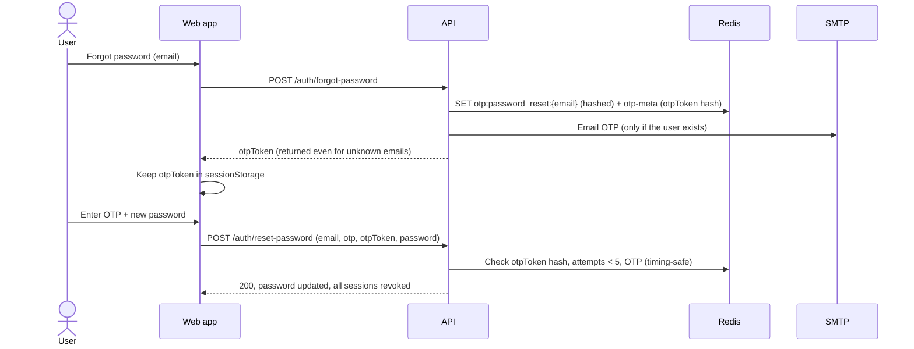

# Database schema & system model — v2

This is the schema as it runs today, after the migrations below. It was generated from a migrated database (`information_schema` / `pg_indexes`), not written from memory. [v1](./database-and-auth.md) is the original design and is kept for history.

| Migration | Adds |
|-----------|------|
| `1791352800000-InitialSchema` | users, auth_sessions, activity_logs, currencies, accounts, categories (idempotent baseline) |
| `1791353100000-AddTransactionsAndOpeningBalance` | transactions, `accounts.opening_balance` |
| `1791450000000-AddBudgetsAndNotifications` | budgets, notifications |
| `1791540000000-AddTransactionIdempotencyKey` | `transactions.idempotency_key` + per-user unique index |
| `1791600000000-AddOutboxAndNotificationEventId` | `outbox_events` (transactional outbox), `notifications.event_id` (unique) |

---

## What changed since v1

| Area | v1 (design) | v2 (implemented) |
|------|-------------|------------------|
| Transactions | Planned | `reference` (`TXN-YYMMDD-XXXXXX`), `counterparty`, `status`, positive `amount` + `type` |
| Wallet balance | Open question | **Derived**: `opening_balance` + completed income − completed expense. Never stored |
| Ownership | `user_id` on each row | Plus **composite FKs** `(account_id, user_id)` / `(category_id, user_id)`. The DB rejects a transaction or budget that points at another user's wallet or category |
| Budgets | "later" | Per **wallet + category + period**; currency is the wallet's; usage derived with `date_trunc` |
| Notifications | — | In-app feed, filled by domain events; budget alerts are also emailed |
| Duplicate protection | — | `idempotency_key` unique per user + a 2-minute soft duplicate check |
| Events | In-process `EventEmitter` | **Transactional outbox** (`outbox_events`, same DB transaction as the write) relayed to a **BullMQ** queue: one job per handler, 5 attempts, no loss on a crash or Redis outage |
| Redis | OTPs | OTPs + attempt counters, refresh-rotation locks, rate-limit counters, event queue |

---

## System overview



---

## Entity-relationship diagram



"(FK)" means a database foreign key; "(logical)" means the column holds a user id but **no FK is declared** (see [Known gaps](#known-gaps)).

---

## Tables

### `transactions`

| Column | Type | Notes |
|--------|------|-------|
| `id` | uuid PK | |
| `reference` | varchar(32), unique | `TXN-YYMMDD-XXXXXX` (UTC date, Crockford base32). On a collision a new one is generated and the insert retried |
| `user_id` | uuid | Owner. Part of both composite FKs |
| `account_id` | uuid | FK `(account_id, user_id)` → `accounts(id, user_id)`, `ON DELETE RESTRICT` |
| `category_id` | uuid | FK `(category_id, user_id)` → `categories(id, user_id)`, `ON DELETE RESTRICT` |
| `type` | varchar(10) | CHECK `income` / `expense`. Gives the direction |
| `amount` | numeric(19,4) | CHECK `> 0`. The sign comes from `type` |
| `status` | varchar(12) | CHECK `pending` / `completed` / `failed`. Default `completed`, and only `completed` counts toward balances and budgets |
| `counterparty` | varchar(160) | Payer / payee |
| `narration` | text | |
| `occurred_at` | timestamptz | When the money moved; used for periods and filters |
| `idempotency_key` | uuid, null | `Idempotency-Key` of the create request. NULL for older rows |

Indexes: `(user_id, occurred_at)`, `(account_id, occurred_at)`, `(user_id, category_id, occurred_at)`, plus a partial unique index `(user_id, idempotency_key) WHERE idempotency_key IS NOT NULL`.

### `budgets`

One spending limit per **wallet + category + period**, enforced by `UQ_budgets_scope (user_id, category_id, account_id, period)`. Composite FKs keep the wallet and the category owned by the same user. CHECKs: `amount > 0`, `period IN (weekly, monthly, yearly)`. The UI can create several budgets in one call (one per selected category), and the insert is atomic.

### `notifications`

In-app feed. `type` is the source event (`transaction.created`, `budget.threshold_reached`, …) and `data` holds ids or amounts for the UI. `event_id` is the outbox id of that event; its partial unique index means a redelivered event can't create a second notification (or send a second alert email). Indexes: `(user_id, created_at)` for the feed, and a partial `(user_id) WHERE read_at IS NULL` for the unread badge.

### `outbox_events`

Transactional outbox. Each domain event is inserted in the **same DB transaction** as the change that raised it, so it exists if and only if that change committed. `OutboxRelay` reads rows with `published_at IS NULL` (partial index `IDX_outbox_events_pending`), enqueues them on BullMQ and sets `published_at`. `id` is the event id handlers receive, and it is part of every job id. `dedupe_key` (partial unique) lets an emitter that may run twice, such as a retried budget check, record an event once. Published rows are deleted after 7 days.

### `accounts` (wallets)

`currency_code` FK → `currencies(code)`. It is fixed after creation, and every amount on the wallet uses that currency. `opening_balance` numeric(19,4) is editable. A partial unique `(user_id) WHERE is_default` allows one default wallet per user, and `UQ (id, user_id)` is the target of the composite FKs. Archiving (`archived_at`) blocks new transactions but keeps history.

### `categories`

`kind` is `income`, `expense` or `both`. A transaction's `type` must be compatible with it (checked in the application). `UQ (user_id, name)` stops duplicates; `UQ (id, user_id)` is the target of the composite FKs.

### `users`, `auth_sessions`, `activity_logs`, `currencies`

These are unchanged from v1. The refresh token is stored only as a hash (unique). Sessions are revoked by setting `revoked_at`. Activity logs are append-only and written by the `@LogActivity` interceptor, with `metadata.requestId` linking each row to the request logs. Currencies are seeded idempotently on boot.

---

## Derived values (never stored)

```sql
-- Wallet balance
balance = accounts.opening_balance
        + SUM(amount) FILTER (WHERE type = 'income'  AND status = 'completed')
        - SUM(amount) FILTER (WHERE type = 'expense' AND status = 'completed')

-- Budget usage in the current period
period_start = date_trunc('week' | 'month' | 'year', now())      -- DB time zone, ISO weeks
spent        = SUM(t.amount) WHERE t.account_id = b.account_id
                                AND t.category_id = b.category_id
                                AND t.type = 'expense' AND t.status = 'completed'
                                AND t.occurred_at >= period_start
                                AND t.occurred_at <  period_start + interval '1 <unit>'
```

Storing either value would mean keeping a cached copy correct across every create, edit and delete. Deriving them keeps one source of truth, and the existing indexes keep the queries cheap at this scale.

---

## Integrity rules at a glance

| Rule | Enforced by |
|------|-------------|
| A transaction or budget can't point at another user's wallet or category | Composite FKs `(account_id, user_id)` and `(category_id, user_id)` |
| Wallets and categories in use can't be deleted | `ON DELETE RESTRICT` |
| Amounts are positive | CHECK `amount > 0` (transactions, budgets) |
| Enum-like columns hold valid values | CHECKs on `transactions.type`, `transactions.status`, `budgets.period` |
| One default wallet per user | Partial unique index |
| One budget per wallet + category + period | `UQ_budgets_scope` |
| A create retried with the same key never inserts twice | Partial unique `(user_id, idempotency_key)` |
| Transaction references are unique | `UQ_transactions_reference` |
| A domain event exists only if its write committed | Outbox row inserted in the same transaction |
| A redelivered event creates one notification | Partial unique `notifications.event_id` |
| Category name is unique per user | `UQ_categories_user_name` |
| Money precision | `numeric(19,4)`; the API rejects input with more decimals than the wallet's currency |

### Known gaps

- **No FK from `user_id` to `users(id)`** on `accounts`, `categories`, `auth_sessions`, `notifications`, `activity_logs` (or on `transactions` / `budgets`, which inherit ownership through the composite FKs). The application always scopes by the JWT user, so this hasn't caused bugs. A v3 migration should still add `FK … REFERENCES users(id)`, with `ON DELETE CASCADE` for sessions and notifications and `RESTRICT` for financial rows. `activity_logs` should stay without an FK, since it is an audit trail and must outlive deletes.
- **`categories.kind` has no CHECK**. Only the application validates it.

---

## Redis keyspace

Postgres holds everything durable. Redis holds short-lived or coordination state, plus the event queue.

| Key | Type / TTL | Purpose |
|-----|-----------|---------|
| `otp:{purpose}:{email}` | string, `EMAIL_OTP_TTL_SECONDS` | Hashed OTP (`email_verify`, `password_reset`, `password_change`) |
| `otp-meta:{purpose}:{email}` | hash, same TTL | `attempts` (max 5) and the `otpToken` hash that ties a reset to the client that requested it |
| `refresh:lock:{tokenHash}` | `SET NX PX 5000` | One rotation per refresh token at a time |
| `refresh:result:{tokenHash}` | string, 30 s | Replays the rotated pair to concurrent / late callers that used the same token |
| throttler keys | counters, 60 s | `@nestjs/throttler` (global, strict auth 5/min, refresh 30/min) |
| `bull:domain-events:*` | BullMQ | Waiting, delayed (backoff), completed (24 h) and failed (7 days) event jobs. Job id `{eventId}.{handler}` |

---

## Flows

### 1. Create a transaction (idempotency + soft duplicate check)



### 2. Domain events: outbox → BullMQ



- Each handler is its own job, so a failing notification never re-runs the budget check for the same event.
- **No lost events:** the outbox row commits with the write. If the API dies or Redis is down before relaying, the row stays pending and is relayed on the next pass or after a restart. If the API stops mid-retry, the jobs are still in Redis and the next instance continues them. (Both verified with the API killed: each notification was delivered exactly once.)
- **No duplicates:** a row relayed twice yields the same job ids, which BullMQ ignores. A job that runs twice (a BullMQ retry or stalled-job recovery) is absorbed by the handlers: notifications are unique per `event_id`, budget alerts use a dedupe key, and default wallets and categories only insert what's missing.
- Handlers rethrow so that retries happen.
- **Delivery latency:** up to ~1 s (the relay poll interval).

| Event | Emitted by | Handlers |
|-------|-----------|----------|
| `user.activated` | verify email | `DefaultAccountsListener.handle`, `DefaultCategoriesListener.handle` |
| `account.created` / `account.updated` | accounts | notifications |
| `transaction.created` / `.updated` / `.deleted` | transactions | budgets (threshold check), notifications |
| `budget.threshold_reached` | budgets | notifications (in-app + email) |

### 3. Budget alert



Alerts fire when a change *crosses* a threshold (the delta between before and after), so edits and deletes are handled too. Over-budget expenses are never blocked: the transaction already happened.

### 4. Refresh token rotation (concurrent calls)



### 5. Forgot password (OTP bound to the requesting client)



---

## Request tracing

Every request carries `X-Request-Id`. The client sends one, or the API generates one. That id appears in the pino logs, in error bodies (`requestId`), in `activity_logs.metadata.requestId` and as a Sentry tag.
